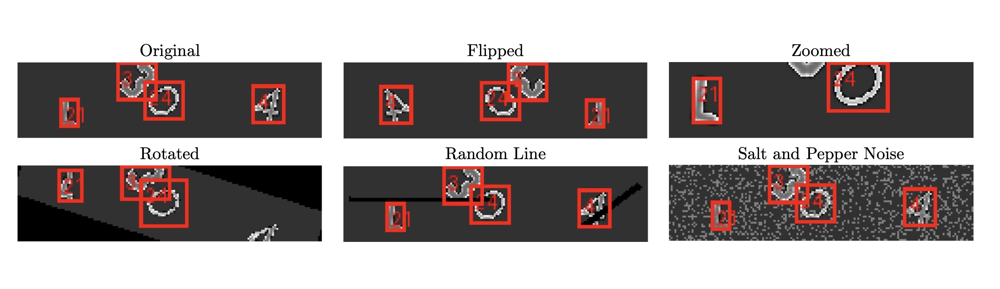

# UTN_Captcha_Detector

This is a project to detect CAPTCHA using [Single Shot Multibox Detector (SSD)](https://arxiv.org/abs/1512.02325).

The following repos were referred for the pytorch implementation of SSD. However most implementations are done
for square (300x300) images, in this project we adapt the models for rectangular smaller images.
Multiple utility functions are also directly adapted.

https://github.com/sgrvinod/a-PyTorch-Tutorial-to-Object-Detection

https://www.kaggle.com/code/thongnon1996/object-detection-mnist-ssd-pytorch-from-scratch

# Project Structure

The project architecture is shown below, the full hyperparameters space is listed in [config files](./configs/configs_common_full.yaml)
and used for training, evaluating and hyperparamer tuning.


```
configs  
datasets  
docs_and_results  
notebooks
src_code  
├── data_utils 
│   ├── augmentation.py  
│   ├── dataset_utils.py  
│   ├── preprocessing.py  
├── model_utils  
│   ├── backbone.py  
│   ├── counter.py  
│   ├── loss.py  
│   ├── mnist_ssd.py  
│   ├── ssd.py  
│   ├── train_utils.py  
│   ├── utils_mnist_ssd.py  
│   ├── utils.py  
task_utils 
│   ├── config_parser.py  
│   ├── evaluation.py 
main.py  
README.md  
requirements_conda.yaml  
requirements.txt

```
# Evaluation
In the repo, there is a curated_version of the exact final dataset,
this helps with quick testing and verification, for a full run the full dataset 
must be placed inside [datasets](./datasets) and path adjusted in the respective [configs](./configs/configs_common_full.yaml)
file.

In order to facilitate evaluation of our model, we include our best checkpoint and 
a [demo.ipynb](./notebooks/demo.ipynb) along with its config file [notebook_config](configs/configs_common_notebook.yaml)
for replicating the final json predictions and checking the final edit distance.


# Augmentations

We used the following augmentations for our captcha images:



# Contribution guidelines

1. Please check linting issues with flake8

   ``flake8``
2. keep requirements.txt and requirements_conda.yaml simulataneously updated
3. review each others code
4. add references for any code snippets used from outside

# CIP Pool setup

Since the CIP pool computers are limited in memory, the project has to be setup in the /var/lit2425/<your_team>/computer_vision directory.
In order to direct the pip package manager to install packages in a separate directory:

```
mkdir pip_cache
python -m venv "captcha_env"
source captcha_env/bin/activate
pip install -r UTN_Captcha_Detector/requirements.txt --cache-dir ./pip_cache/
```

# Alex Cluster setup

First create the conda environment if it doesn't exist

```
conda env create -f requirements_conda.yaml
```

Transfer the dataset to the cluster using the following command

```
cd $WORK
scp -r <local_dataset_directory> alex:<remote_path>

e.g. scp sample_img.png alex:/home/atuin/v123be/v123be12
```

Ensure main.py works in a quick interactive session

```
salloc --gres=gpu:a40:1 --time=0:30:00
conda activate captcha_env
python main.py
```

Submit the job

```
sbatch captcha.job
```

# Run the main file

activate the environment, change to desired parameters in configs/configs_common_simple.yaml
Optionally, log_expt can be set to True to view the training status in realtime in [wandb](https://wandb.ai/site).

Note that running [main.py](./main.py) for the first time is going to create a preprocessed dataset, which will enable faster training
but currently preprocessing happens on the fly during training just to facilitate experimentation.

```
python main.py configs/configs_common.yaml
```

