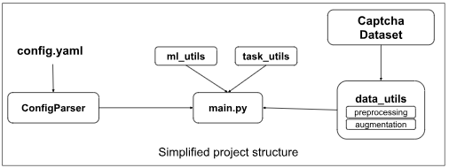

# UTN_Captcha_Detector

This is a project to detect CAPTCHA using a single-shot multi-box detector.


Main Resource for the loss function used:

https://github.com/sgrvinod/a-PyTorch-Tutorial-to-Object-Detection

https://www.kaggle.com/code/thongnon1996/object-detection-mnist-ssd-pytorch-from-scratch





# Contribution guidelines

1. Please check linting issues with flake8

   ``flake8``
2. keep requirements.txt and requirements_conda.yaml simulataneously updated
3. review each others code
4. add references for any code snippets used from outside

# CIP Pool setup

Since the CIP pool computers are limited in memory, the project has to be setup in the /var/lit2425/<your_team>/computer_vision directory.
In order to direct the pip package manager to install packages in a separate directory:

```
mkdir pip_cache
python -m venv "captcha_env"
source captcha_env/bin/activate
pip install -r UTN_Captcha_Detector/requirements.txt --cache-dir ./pip_cache/
```

# Alex Cluster setup

First create the conda environment if it doesn't exist

```
conda env create -f requirements_conda.yaml
```

Transfer the dataset to the cluster using the following command

```
cd $WORK
scp -r <local_dataset_directory> alex:<remote_path>

e.g. scp sample_img.png alex:/home/atuin/v123be/v123be12
```

Ensure main.py works in a quick interactive session

```
salloc --gres=gpu:a40:1 --time=0:30:00
conda activate captcha_env
python main.py
```

Submit the job

```
sbatch captcha.job
```

# Local Setup

activate the environment, change to desired paramters in configs/configs_common.yaml

```
python main.py configs/configs_common.yaml
```

# Project Structure

```
configs  
datasets  
docs_and_results  
notebooks
src_code  
├── data_utils 
│   ├── augmentation.py  
│   ├── dataset_utils.py  
│   ├── preprocessing.py  
├── model_utils  
│   ├── backbone.py  
│   ├── counter.py  
│   ├── loss.py  
│   ├── mnist_ssd.py  
│   ├── ssd.py  
│   ├── train_utils.py  
│   ├── utils_mnist_ssd.py  
├── utils.py  
task_utils 
│   ├── config_parser.py  
│   ├── evaluation.py 
main.py  
README.md  
requirements_conda.yaml  
requirements.txt

```
